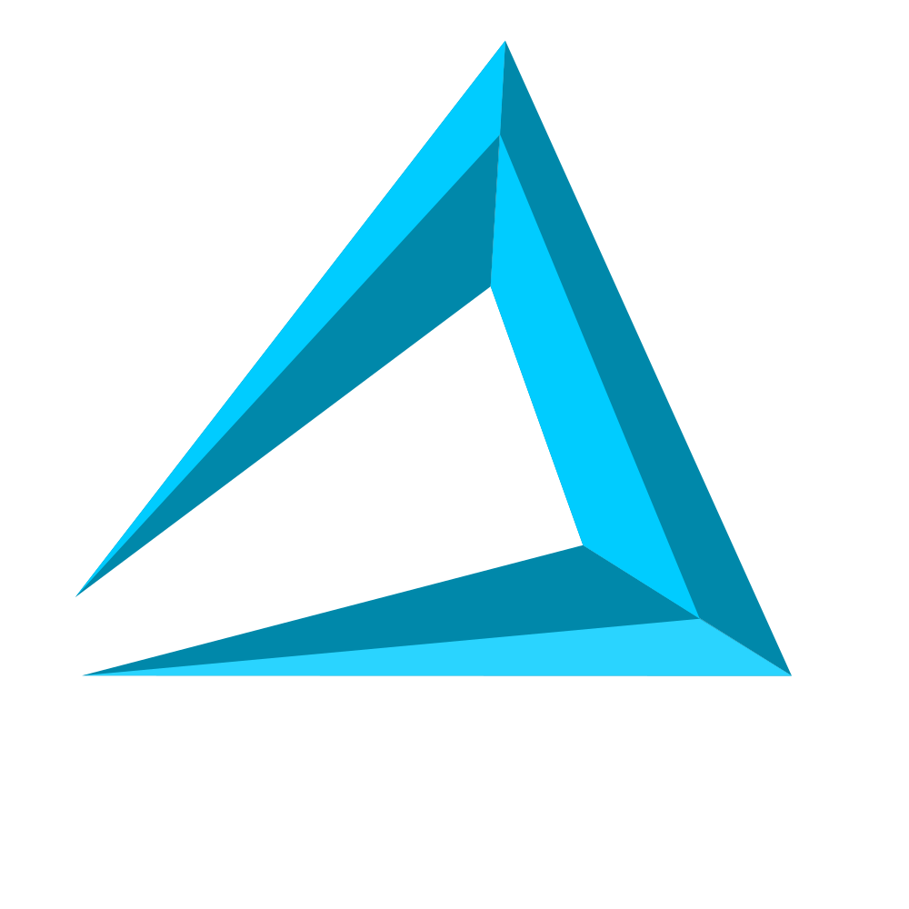
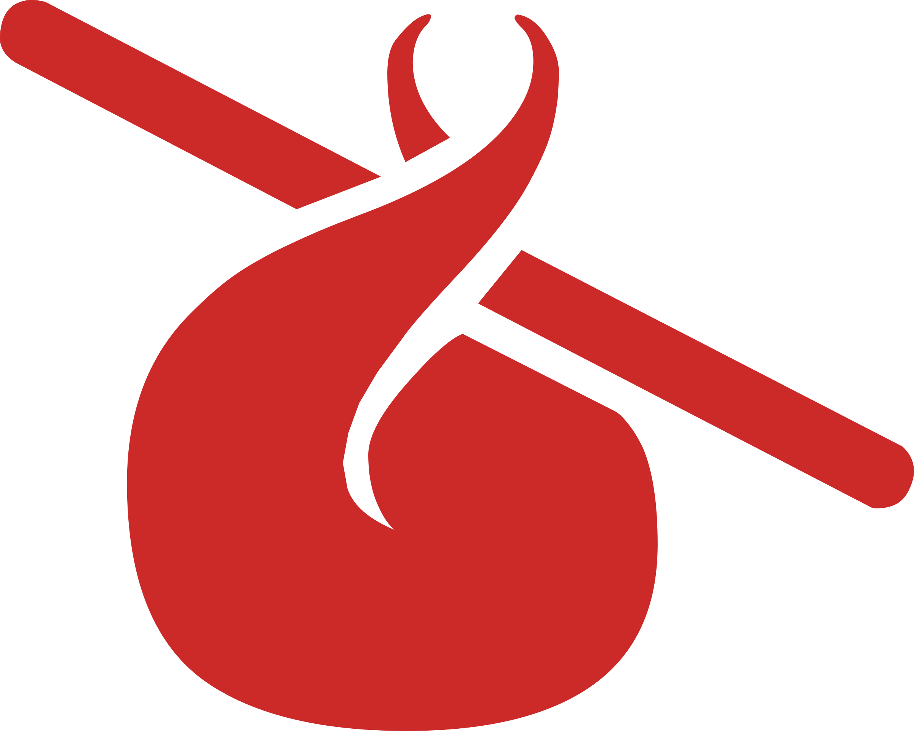

<div align="center">
  
  <h3>AutomatiK</h3>
  <p>A Discord bot that tracks free game offers across multiple platforms and notifies your server.</p>
</div>

> [!IMPORTANT]
> v2.0 is now out! Check out the [release notes](https://github.com/Axyss/AutomatiK/releases/tag/v2.0.0) for all the new features and improvements.

## 📋 Features

- **Rich Embeds**: Game metadata powered by the **IGDB API**. [_Example_](docs/assets/embed.png)
- **AI Fallback**: Resilient parsing by relaying on LLMs when standard methods fail. _Currently supporting Google, Anthropic, and OpenAI models._
- **Minimal Permissions**: No need for admin rights nor privileged intents.

### Supported Platforms

&nbsp;

&nbsp;

&nbsp;

&nbsp;


## 🤖 Commands
`/channel`: Select/unselect the channel where notifications will be sent.<br>
`/services`: Enable/disable specific platform notifications for your server.<br>
`/mention`: Set/unset the role mentioned on notifications.<br>
`/language`: Switch between languages.

## 🚀 Deployment

### Docker (Recommended)

1. Create a `docker-compose.yml` file with the following content:
   ```yaml
   version: "3.9"
   services:
     mongo:
       image: mongo
       volumes:
         - mongo-data:/data/db
     bot:
       image: ghcr.io/axyss/automatik:latest
       depends_on:
         - mongo
       environment:
         DB_URI: "mongodb://mongo:27017"
         DISCORD_TOKEN: ""

         # Optional settings
         LLM_MODEL: "" # Examples: google:gemini-2.5-flash, openai:gpt-5-mini
         LLM_API_KEY: ""

         IGDB_CLIENT_ID: ""
         IGDB_CLIENT_SECRET: ""

         # Developer settings
         #DEBUG_MESSAGES: true
         #DEBUG_GUILD_ID: ""

   volumes:
     mongo-data:
   ```

2. Fill `DISCORD_TOKEN` with your own token from the Discord Developer Portal.
3. Launch the containers:
   ```bash
   docker-compose up -d
   ```

### Manual Installation
**Requirements:** Python 3.12.10 and a MongoDB instance.

1. Clone and install dependencies:
   ```bash
   git clone https://github.com/Axyss/AutomatiK.git && cd AutomatiK
   pip install -r requirements.txt
   ```
2. Prepare your own .env file:
   ```bash
   cp .env.template .env
   ```
   Fill in your `DISCORD_TOKEN` and `DB_URI` in your newly `.env` file.
3. Run the bot:
   ```bash
   python -m automatik.bot
   ```

## 📄 License

This project is licensed under the [MIT license](https://github.com/Axyss/AutomatiK/blob/master/LICENSE).
